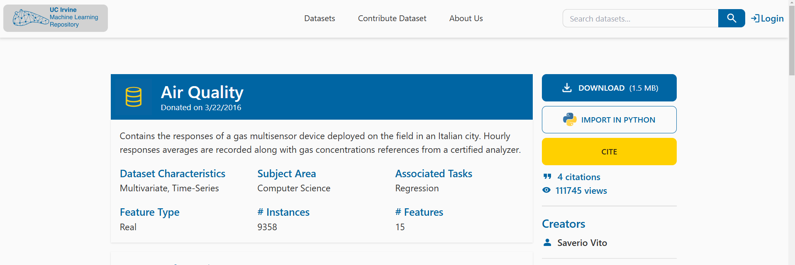
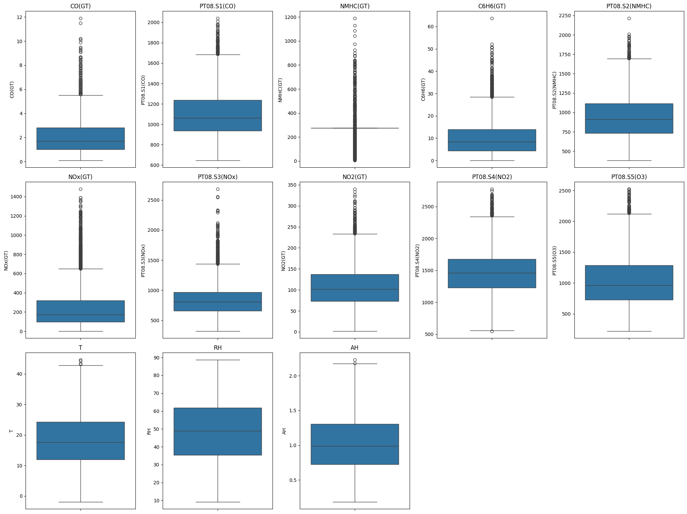
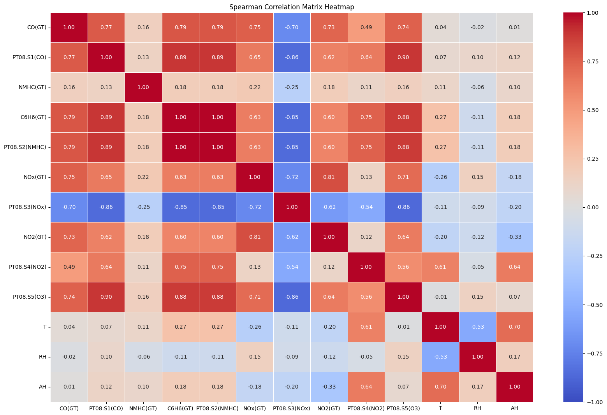
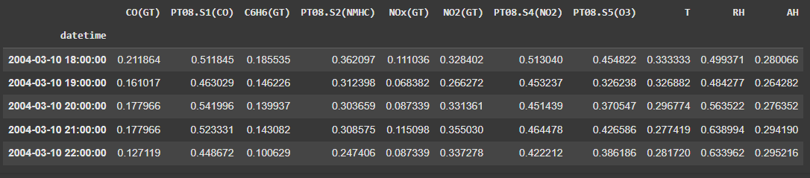
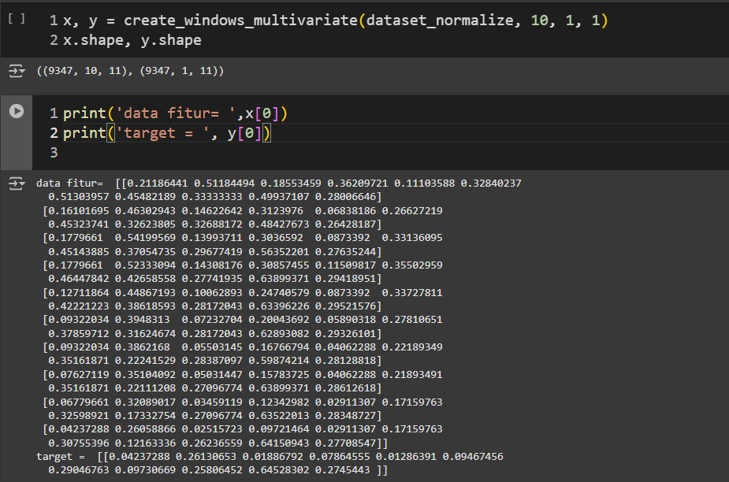
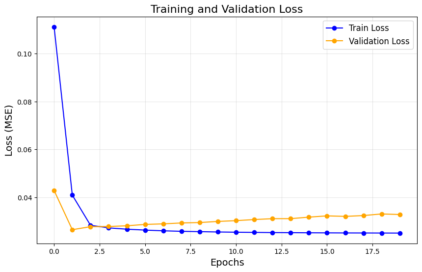
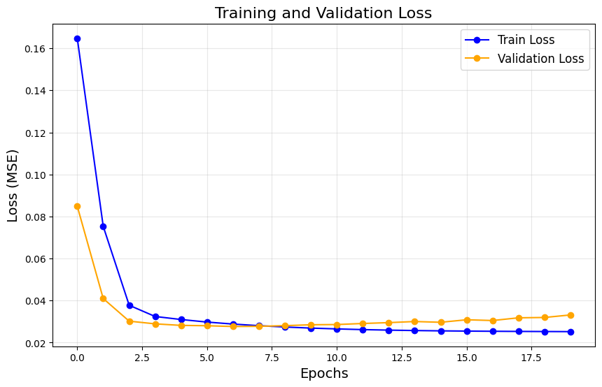
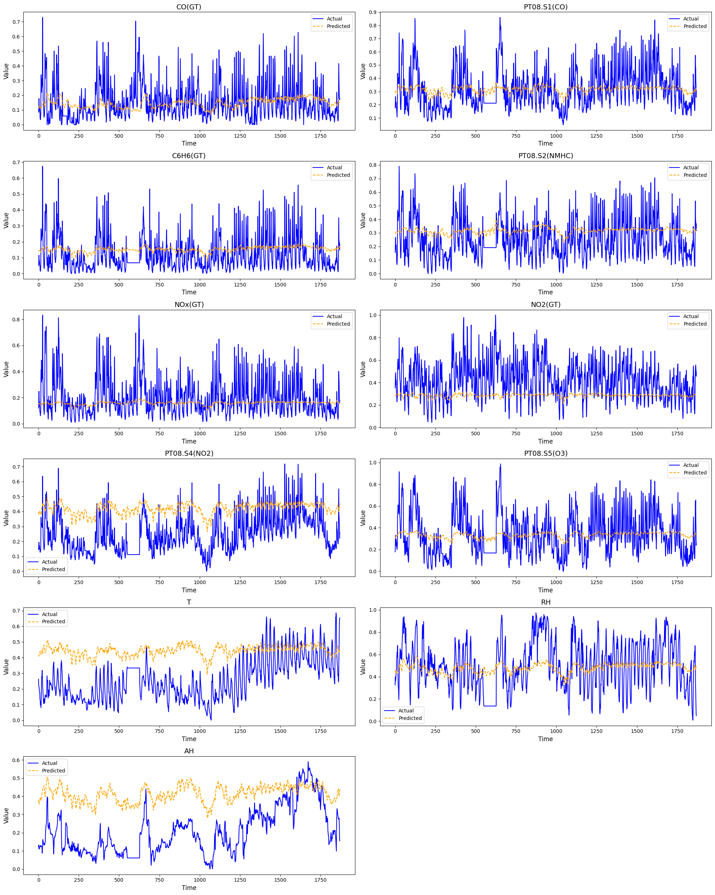
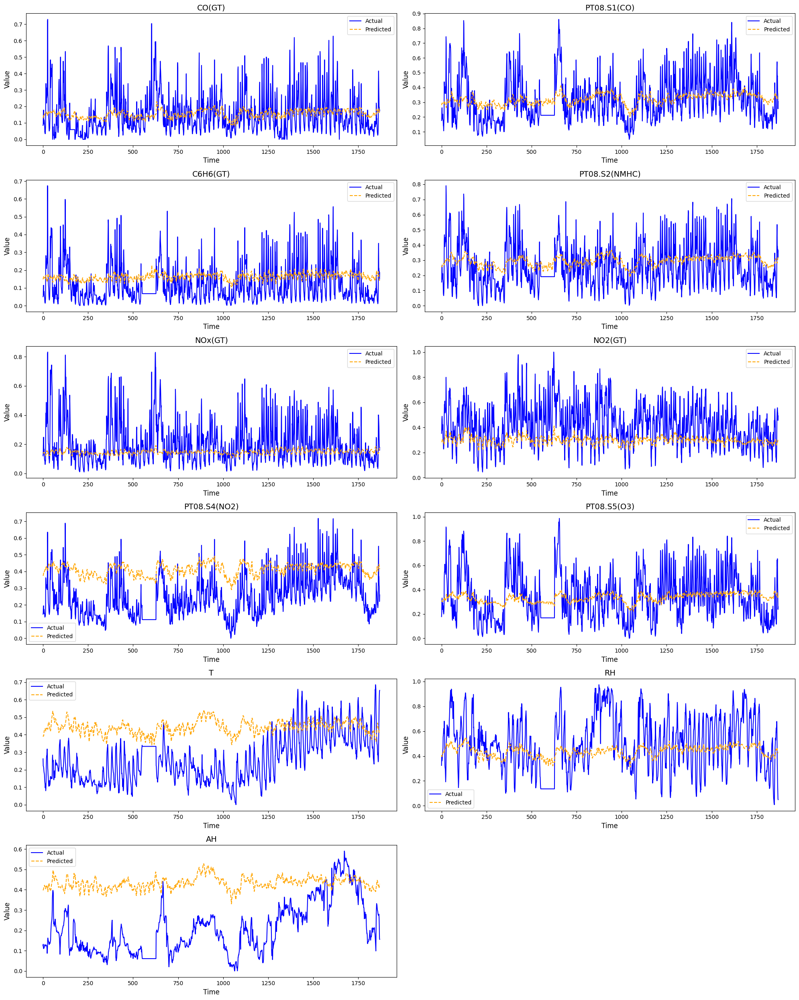

# Laporan Proyek Machine Learning - Muhamad Fahmi Ammar

## Domain Proyek

Berdasarkan laporan dari [IQAir](https://www.iqair.com/id/indonesia/banten/tangerang?srsltid=AfmBOopo2Y_s_HrcyUvLpjlxpiThlZQFrc7Jpe4lgFVnFZoENEGvS8kj), Tangerang termasuk salah satu dari empat kota di Indonesia yang memiliki tingkat polusi udara yang tinggi. Hal ini dapat dilihat dari konsentrasi PM2.5 yang melampaui ambang batas standar kualitas udara tahunan yang ditetapkan oleh Organisasi Kesehatan Dunia (WHO). Tingginya konsentrasi PM2.5 menunjukkan bahwa udara di wilayah tersebut mengandung partikel-partikel halus yang berpotensi membahayakan kesehatan, terutama bagi sistem pernapasan dan kardiovaskular.

Dalam upaya memahami pola polusi udara dan memberikan wawasan untuk mitigasi di masa mendatang, penulis ingin melakukan prediksi tingkat konsentrasi polutan menggunakan metode Long Short-Term Memory (LSTM), yang merupakan salah satu algoritma deep learning yang efektif dalam menangani data berurutan seperti [time series](https://ieeexplore.ieee.org/abstract/document/9005997). Prediksi konsentrasi polutan menjadi penting karena dapat membantu pemangku kebijakan, industri, dan masyarakat umum dalam membuat keputusan yang lebih tepat waktu dan berbasis data untuk mengurangi dampak kesehatan yang ditimbulkan oleh polusi udara. Dengan adanya prediksi yang akurat, langkah-langkah pencegahan dapat diambil lebih awal, seperti membatasi aktivitas di luar ruangan saat polusi diperkirakan meningkat, atau mengimplementasikan kebijakan lingkungan yang lebih ketat di daerah dengan risiko tinggi.

Data yang digunakan untuk penelitian ini diperoleh dari [UCI Machine Learning Repository](https://archive.ics.uci.edu/dataset/360/air+quality), yang berisi data respons perangkat multisensor gas yang ditempatkan di lapangan pada sebuah kota di Italia. Data ini mencakup rata-rata respons sensor setiap jam, beserta konsentrasi gas yang diukur menggunakan alat analisa bersertifikat. Dengan menggunakan model LSTM, penulis berharap dapat memprediksi pola konsentrasi polutan di udara berdasarkan data historis, sehingga dapat mendukung upaya pengendalian dan perbaikan kualitas udara di kota-kota dengan polusi tinggi seperti Tangerang.

## Business Understanding

Dalam memprediksi Konsentrasi polutan di Tangerang, diperlukan model yang mampu mengolah data time series dari berbagai sumber dengan karakteristik unik, seperti multisensor. Dataset yang digunakan memiliki 15 fitur, termasuk respons dari beberapa sensor gas, yang menyajikan tantangan dalam pemilihan fitur yang relevan dan pengelolaan missing values untuk menjaga kualitas data.


### Problem Statements

Berdasarkan latar belakang penelitian, penulis merumuskan beberapa rumusan masalah, yaitu: 
- Bagaimana Melakukan pemilihan fitur dari 15 fitur yang tersedia sehingga model dapat fokus pada fitur yang paling signifikan?
- Bagaimana mengembangkan model prediksi berbasis Long Short-Term Memory (LSTM) yang dapat secara akurat memproyeksikan konsentrasi polutan di masa depan menggunakan data time series multisensor?

### Goals

Menjelaskan tujuan dari pernyataan masalah:
- Mengoptimalkan pemilihan fitur dari 15 fitur yang tersedia sehingga model dapat fokus pada fitur yang paling signifikan
- Mengembangkan model prediksi berbasis Long Short-Term Memory (LSTM) yang dapat secara akurat memproyeksikan konsentrasi polutan di masa depan menggunakan data time series multisensor

### Solution Statements

Untuk mencapai Goals yang telah ditentukan, berikut merupakan solusi yang akan diimplementasikan.

1. Dalam pemilihan fitur, penulis menggunakan korelasi fitur, sehingga pemilihan fitur optimal

2. Dalam mengembangkan prediksi menggunakan LSTM, penulis menerapkan hyper parameter tunning dengan menggunakan _grid search_. Parameter-parameter tersebut berupa jumlah batch, _learning rate_, dan metode optimisasi. Dari proses hyper parameter tunning akan analisis performa model nya sehingga mendapatkan model terbaik. 

## Data Understanding

Data yang penulis gunakan adalah Data berasal dari UCI [opensouce](https://archive.ics.uci.edu/dataset/360/air+quality). Dataset ini berisi contoh data yang merupakan rata-rata per jam dari lima sensor kimia metal oksida yang dipasang di perangkat multisensor kualitas udara. Alat ini ditempatkan di area yang sangat tercemar pada tingkat jalan di sebuah kota di Italia. Data dikumpulkan selama satu tahun, dari Maret 2004 hingga Februari 2005 yang berjumlah 9358, yang merupakan rekaman terpanjang untuk data respons sensor kualitas udara di lapangan yang tersedia secara bebas.`Missing Values` ditandai dengan nilai `-200`.

### Deskripsi Variabel

Berikut merupakan deskripsi variabel dataset.

- Date	: Tanggal mengambil data
- Time	: Waktu Mengambil data
- CO(GT) : Konsentrasi rata-rata per jamCO dalam mg/m^3 
- PT08.S1 (CO) : respon sensor rata-rata per jam `(CO)`
- NMHC(GT) : konsentrasi rata-rata per jam NMHC dalam microg/m^3
- C6H6(GT) : konsentrasi rata-rata per jam  in microg/m^3
- PT08.S2 (NMHC) : respon sensor rata-rata per jam `(NMHC)`	
- NOx(GT) : konsentrasi rata-rata perjam NOx dalam ppb
- PT08.S3(NOx) : respon sensor rata-rata per jam (NOx) 
- NO2(GT) : konsentrasi per jam NO2 dalam microg/m^3 	
- PT08.S4(NO2) : respon sensor rata-rata per jam (NO2)
- PT08.S5 (O3) : respon sensor rata-rata per jam (O3)
- T : Temperature dalam (°C)	
- RH : Relative Humidity (%) 	
- AH : Absolute Humidity

Adapun pengecekan informasi setiap data, seperti jumlah data dan tipe data, untuk mengetahui kondisi data saat ini.

| No  | Column        | Non-Null Count | Dtype   |
|-----|---------------|----------------|---------|
|  0  | Date          | 9357 non-null  | object  |
|  1  | Time          | 9357 non-null  | object  |
|  2  | CO(GT)        | 9357 non-null  | object  |
|  3  | PT08.S1(CO)   | 9357 non-null  | float64 |
|  4  | NMHC(GT)      | 9357 non-null  | float64 |
|  5  | C6H6(GT)      | 9357 non-null  | object  |
|  6  | PT08.S2(NMHC) | 9357 non-null  | float64 |
|  7  | NOx(GT)       | 9357 non-null  | float64 |
|  8  | PT08.S3(NOx)  | 9357 non-null  | float64 |
|  9  | NO2(GT)       | 9357 non-null  | float64 |
| 10  | PT08.S4(NO2)  | 9357 non-null  | float64 |
| 11  | PT08.S5(O3)   | 9357 non-null  | float64 |
| 12  | T             | 9357 non-null  | object  |
| 13  | RH            | 9357 non-null  | object  |
| 14  | AH            | 9357 non-null  | object  |
| 15  | Unnamed :16   | 0 non-null     | object  |
| 16  | Unnamed :16   | 0 non-null     | object  |

Dengan menggunakan `pandas.info`, terdapat entri yang terbaca yaitu berjumlah `9471`. Hal ini merupakan tanda bahwa terdapat `114` data missing values. Selain itu, terdapat kolom yang memiliki `nilai non-null = 0`, yaitu kolom `Unnamed :15` dan `Unnamed :16`. Hal ini mengartikan bahwa kedua kolom tersebut memiliki 0 data, atau berisi null data. Oleh karena itu, penulis perlu menghapus kedua kolom ini.

### Deskriptif Statistik
Penulis perlu untuk mengetahui deskripsi statistik dari setiap data.

|Stats| PT08.S1(CO) | NMHC(GT)   | PT08.S2(NMHC) | NOx(GT)    | PT08.S3(NOx) | NO2(GT)    | PT08.S4(NO2) | PT08.S5(O3) |
|--------------|-------------|------------|---------------|------------|--------------|------------|--------------|-------------|
| count        | 9357.000000 | 9357.000000 | 9357.000000  | 9357.000000 | 9357.000000 | 9357.000000 | 9357.000000 | 9357.000000 |
| mean         | 1048.990061 | -159.090093 | 894.595276   | 168.616971  | 794.990168   | 58.148873   | 1391.479641  | 975.072032  |
| std          | 329.832710  | 139.789093  | 342.333252   | 257.433866  | 321.993552   | 126.940455  | 467.210125   | 456.938184  |
| min          | -200.000000 | -200.000000 | -200.000000  | -200.000000 | -200.000000  | -200.000000 | -200.000000  | -200.000000 |
| 25%          | 921.000000  | -200.000000 | 711.000000   | 50.000000   | 637.000000   | 53.000000   | 1185.000000  | 700.000000  |
| 50%          | 1053.000000 | -200.000000 | 895.000000   | 141.000000  | 794.000000   | 96.000000   | 1446.000000  | 942.000000  |
| 75%          | 1221.000000 | -200.000000 | 1105.000000  | 284.000000  | 960.000000   | 133.000000  | 1662.000000  | 1255.000000 |
| max          | 2040.000000 | 1189.000000 | 2214.000000  | 1479.000000 | 2683.000000  | 340.000000  | 2775.000000  | 2523.000000 |

Dalam hal ini, penulis melihat dari setiap data memiliki nilai `-200` yang berarti terdapat missing values seperti yang diinformasikan oleh data `open-sorce`. Pada data `NMHC(GT)` terlihat bahwa memiliki nilai `Q1, Q2, dan Q3` yaitu `-200`. Dalam data tersebut, terlalu banyak missing values nya. Pada sensor `PT08.S1(CO)`, `PT08.S2(NMHC)`, `PT08.S3(NOx)`, `PT08.S4(NO2)`, dan `PT08.S5(O3)`, memiliki nilai maksimal rata-rata yaitu diatas `2000`. Hal ini menunjukkan apakah data tersebut merupakan `outlier` atau merupakan suasana ekstrim saat pengambilan data tersebut.


### Drop kolom Unnamed
Pada saat melakukan data assesing, terdapat kolom `Unnamed:15` dan `Unnamed:16`. Karena data tersebut tidak memiliki data sama sekali, penulis menghapus nya menggunakan `drop`. Berikut kode untuk menghapus kolom tersebut.
```python
dataset.drop(columns=['Unnamed: 15', 'Unnamed: 16'], errors='ignore')
```

### Analisis Missing Value

Hal yang perlu diketahui missing values dalam dataset ini memiliki 2 jenis, yaitu bernilai `Nan` dan `-200`. Dalam Deskripsi Variabel kita mengetahui bahwa nilai `Nan` dari setiap data itu berjumlah `114` jika dijumlahkan yaitu `1710` data. 

#### Nan Values
Dengan menggunakan `dataset.isna().sum()` kita dapat melihat jumlah `Nan` dari setiap data.

| Column       | Value |
|--------------|-------|
| Date         | 114   |
| Time         | 114   |
| CO(GT)       | 114   |
| PT08.S1(CO)  | 114   |
| NMHC(GT)     | 114   |
| C6H6(GT)     | 114   |
| PT08.S2(NMHC)| 114   |
| NOx(GT)      | 114   |
| PT08.S3(NOx) | 114   |
| NO2(GT)      | 114   |
| PT08.S4(NO2) | 114   |
| PT08.S5(O3)  | 114   |
| T            | 114   |
| RH           | 114   |
| AH           | 114   |

Strategi untuk mengatasi nilai `Nan` adalah dengan melihat posisi nilai `Nan` terlebih dahulu ada kemungkinan nilai `Nan` itu berada di index acak yang mana pada satu baris, hanya ada `1 Nan Values`, data pada kolom lain bukan `Nan`. Untuk menghindari hal ini, penulis perlu memerhatikan letak dari `Nan` values ini. Berikut merupakan pola data `Nan values`.


Jika berada di posisi acak, maka yang harus dilakukan adalah, mengubah nilai `Nan` menjadi nilai yang sama dengan data sebelumnya atau setelahnya. Pada pandas dapat dipahami dengan `fillna` dan menggunakan metode `bfill` atau `ffill`.

Karena tidak di posisi acak dan dalam satu baris merupakan nilai `Nan` semua, maka penulis dapat mengambil tindakan dengan menghapus baris tersebut dengan `drop`.

#### Anomali Values (-200)
Melihat deksripsi analisis, kita mengetahui bahwa nilai `-200` setiap data itu berbeda-beda. Seperti contohnya pada data `NMHC(GT)` yang memiliki `Q1, Q2, dan Q3` bernilai `-200`.

Dengan menggunakan `dataset[dataset==-200].count()` kita dapat melihat jumlah setiap data yang bernilai `-200`.

| Column       | Value |
|--------------|-------|
| Date         | 0     |
| Time         | 0     |
| CO(GT)       | 1683  |
| PT08.S1(CO)  | 366   |
| NMHC(GT)     | 8443  |
| C6H6(GT)     | 366   |
| PT08.S2(NMHC)| 366   |
| NOx(GT)      | 1639  |
| PT08.S3(NOx) | 366   |
| NO2(GT)      | 1642  |
| PT08.S4(NO2) | 366   |
| PT08.S5(O3)  | 366   |
| T            | 366   |
| RH           | 366   |
| AH           | 366   |

Strategi untuk mengatasi nilai `-200` adalah dengan melihat posisi nilai `-200` terlebih dahulu ada kemungkinan nilai `-200` itu berada di index acak yang mana pada satu baris, hanya ada `-200`, data pada kolom lain bukan `-200`. Untuk menghindari hal ini, penulis perlu memerhatikan letak dari `-200` values ini. Berikut merupakan pola data anomali `(-200)` 


Jika tidak di posisi acak dan dalam satu baris merupakan nilai `-200` semua, maka penulis dapat mengambil tindakan dengan menghapus baris tersebut dengan `drop`.

Karena berada di posisi acak, maka yang harus dilakukan adalah mengubah nilai `-200` menjadi `Nan` lalu mengubah nya nilai yang sama dengan data sebelumnya atau setelahnya. Pada pandas dapat dipahami dengan `fillna` dan menggunakan metode `bfill` atau `ffill`.


### Analisis Outlier

Untuk mengetahui outlier, penulis perlu memerhatikan outlier setiap data menggunakan `boxplot`.

Melihat dari boxplot tersebut, data NMHC(GT) memiliki data outlier yang begitu banyak. Dalam hal ini, terdapat 10 data yang dianggap memiliki outlier. Karena penulis menggunakan permasalahan regresi, outlier pada 10 data ini kemungkinan adalah fakta lapangan saat suasana ekstrim. Jika penulis mengubah outlier tersebut, akan mempengaruhi prediksi di masa yang akan datang. Oleh karena itu, penulis tidak mengatasinya.

### Analisis Korelasi Antar Fitur

Untuk menganalisis korelasi fitur, penulis menggunakan correlation matrix dengan metode `spearman`.




## Data Preparation

### Data Cleaning
Dalam pembersihan data, kita ketahui bahwa data yang dimiliki adalah data kotor. Terdapat beberapa pembersihan yang perlu dilakukan, seperti berikut

|No. | Pembersihan  | Alasan |Solusi |
|----|--------------|--------|-------|
|1  | Drop Unnamed Column| Karena data tersebut tidak memiliki data sama sekali | Melakukan `drop` pada kolom `Unnamed :15` dan `Unnamed :16`|
|2  | Penanganan Nan Values| Karena terdapat `114 Nan values` setiap kolom  terrekam dalam data | Karena tidak di posisi acak dan dalam satu baris merupakan nilai `Nan` semua, maka penulis dapat mengambil tindakan dengan menghapus baris tersebut dengan `drop`.|
|3 | Penanganan Anomali Values `(-200)`| Karena terdapat `-200 values` setiap kolom  terrekam dalam data dan jumlahnya beragam mulai dari `366` hingga `8443`| Karena berada di posisi acak, maka yang harus dilakukan adalah mengubah nilai `-200` menjadi `Nan` lalu mengubah nya nilai yang sama dengan data sebelumnya atau setelahnya. Pada pandas dapat dipahami dengan `fillna` dan menggunakan metode `bfill` atau `ffill`. Menggunakan cara tersebut membuat nilai `-200` ter-replace dengan nilai sebelumnya ataupun setelahnya.|
|4 | Mengubah kolom `Date` dan `Time` menjadi index|Karena agar data yang akan dilakukan pemodelan itu tidak tercampur dengan data waktu dan data tanggal| - Mengubah format `date`  menjadi ``%d/%m/%Y`` dan format `time` menjadi menggunakan `:`, setelah itu membuat kolom `datetime` yang nilainya merupakan gabungan dari kolom `Date` dan `Time` dan dijadikan index pada `dataset`|

### Feature Selection
Pada korelasi matrix tersebut, penulis melihat korelasi yang rendah pada `PT08.S3(NOx)`. Selain itu pada fitur `NMHC(GT)` memiliki nilai outlier yang sangat tinggi, hal ini disebabkan karena fitur  `NMHC(GT)` memiliki nilai anomali `-200` sebanyak `8443` dari `9357` data. Berdasarkan hal tersebut, agar model dapat memprediksi dengan baik, penulis menghapus kedua fitur tersebut. Penting sekali untuk mengetahui korelasi fitur pada permasalahan regresi. Sehingga fitur-fitur yang digunakan saat dataset memiliki hubungannya saat posisi tren naik atau tren turunnya. 

### Normalisasi Data 

Normalisasi pada data time series dengan 11 fitur beragam bertujuan untuk memastikan setiap fitur memiliki kontribusi yang seimbang dalam proses pembelajaran model, terutama ketika skala fitur berbeda-beda. Dengan menyelaraskan nilai ke rentang tertentu, seperti [0, 1], normalisasi mencegah dominasi fitur berskala besar, mempercepat konvergensi model, dan meningkatkan akurasi prediksi. Selain itu, langkah ini membantu mengurangi masalah numerik, seperti *vanishing* atau *exploding gradients*, yang sering terjadi pada jaringan saraf seperti LSTM. Dengan normalisasi, model dapat mempelajari pola data secara lebih stabil dan efektif.
Proses Normalisasi data dilakukan dengan menggunakan `MinMaxScaler`.  Penulis memanfaatkan library dari `scikit-learn` untuk menormalisasikan data.
```python
# Inisialisasi MinMaxScaler
scaler = MinMaxScaler()
# Fit dan transform data numerik
normalize = scaler.fit_transform(dataset_remove_nan)
# Tampilkan data yang sudah dinormalisasi
dataset_normalize = pd.DataFrame(normalize, columns=dataset_remove_nan.columns, index=dataset_remove_nan.index)
```
Hasil dari normalisasi dapat ditunjukan pada gambar berikut. 


###	Windowing Time Series

Windowing pada *time series* adalah teknik membagi data deret waktu menjadi jendela-jendela kecil yang merepresentasikan rangkaian data sebelumnya untuk memprediksi nilai di masa depan. Teknik ini penting karena memungkinkan model, seperti LSTM, menangkap pola temporal jangka pendek yang relevan dalam data, terutama ketika menangani dataset dengan banyak fitur (*multivariate time series*). Dalam kasus *multi-feature time series*, setiap jendela biasanya terdiri dari nilai-nilai beberapa fitur selama periode waktu tertentu (misalnya, 10 langkah waktu terakhir seperti yang digunakan pada proyek ini). Proses ini dilakukan dengan membentuk array tiga dimensi, dimana dimensi pertama adalah jumlah sampel, dimensi kedua adalah panjang jendela waktu, dan dimensi ketiga adalah jumlah fitur. Windowing membantu model memahami hubungan antara fitur-fitur di setiap jendela waktu, sehingga meningkatkan akurasi prediksi.
Penulis membangun sebuah fungsi untuk mengatur sebuah windowing data time series. Terdapat 3 parameter yang dibutuhkan pada fungsi tersebut, yaitu data, ukuran window, serta jarak antar data yang dilewatinya. Output yang diharapkan berupa 10 data fitur dan 1 data target. Selain itu karena fungsi ini juga dapat bekerja pada multi-feature time series yang digunakan pada proyek ini. Berikut merupakan fungsi windowing.
```python
def create_windows_multivariate(data, window_size, output_size, stride):
    X, y = [], []
    for i in range(0, len(data) - window_size - output_size + 1, stride):
        X.append(data.iloc[i:i + window_size].values)  # input sequence
        y.append(data.iloc[i + window_size:i + window_size + output_size].values)  # output sequence
    return np.array(X), np.array(y)
```
Hasil Windowingnya adalah sebagai berikut.


### Splitting Data
Pada data time series, membagi dataset menjadi 80:20 tanpa menggunakan shuffle dan random state sangat penting untuk menjaga urutan temporal data. Data time series memiliki sifat berurutan di mana nilai masa depan bergantung pada pola di masa lalu. Oleh karena itu, membagi data secara acak (shuffling) dapat merusak hubungan temporal ini dan membuat model kehilangan kemampuan untuk mempelajari pola historis.
Penulis menggunakan `train_test_split` yang ada pada `scikit-learn` dengan parameter `X`, `y`,  `test_size = 0.2`,  dan `shuffle = False`. Hal ini saya terapkan menggunakan code berikut.
```python
# Split data into train and validation sets
X_train, X_val, y_train, y_val = train_test_split(X, y, test_size=0.2, shuffle=False)
```
## Modelling
Pada tahap modelling, penulis menggunakan Metode LSTM dalam memprediksi sensor polutan yang memiliki multi fitur. Ada 2 algoritma yang diterapkan, yaitu LSTM dan GRU. Kedua algoritma ini akan menerapkan grid search sehingga dapat memperoleh performa yang optimal. Parameter yang akan diujikan yaitu `Learning rate = [0.001, 0.0001]`, `Optimizer = ['Adam', 'RMSprop']`, `epoch = 20`, dan ukuran `batch = 64` 

1.	LSTM (Long Short-Term Memory)

Metode Long Short-Term Memory (LSTM) dipilih untuk prediksi data *time series* multi fitur karena keunggulannya dalam mempelajari pola temporal jangka panjang dan pendek secara simultan. Berbasis jaringan saraf *recurrent*, LSTM dilengkapi dengan mekanisme *gates* (input, forget, dan output) yang memungkinkan model menangani masalah umum seperti *vanishing gradients* pada data deret waktu. Literatur menunjukkan bahwa LSTM unggul dalam memodelkan hubungan temporal antar fitur yang kompleks, menjadikannya pilihan ideal untuk prediksi data *[multivariate time series](https://ieeexplore.ieee.org/abstract/document/9005997)*.

Keunggulan algoritma LSTM:
-	Dirancang untuk menangkap pola urutan jangka panjang dalam data time series.
-	Memiliki mekanisme gates (forget, input, output) untuk mengelola informasi penting.
-	Optimal untuk dataset time series yang memiliki pola kompleks dan hubungan temporal kuat.
Kekurangan :
-   Memerlukan waktu pelatihan lebih lama karena arsitekturnya yang kompleks.
Penulis menerapkannya dengan memanfaatkan library `tensorflow.keras.models` untuk membuat modelnya, serta `tensorflow.keras.layers` dalam membangun model dengan layer LSTM. Berikut merupakan model yang penuls bangun sesuai dengan `input_shape` yang ditentukan oleh proses windowing.
```python
model = Sequential([
        LSTM(32, activation='tanh', input_shape=input_shape),
        Dense(output_shape, activation='linear')
    ])
```

2.	GRU (Gated Recurrent Unit)

Untuk mendapatkan hasil yang optimal, LSTM dibandingkan dengan algoritma kuat lainnya, seperti GRU.  Dalam membandingkan performa LSTM dan GRU untuk prediksi data time series, fokus utama adalah pada kemampuan keduanya menangkap pola urutan (temporal) dalam data. LSTM unggul dalam menangani dependensi jangka panjang berkat mekanisme gates yang kompleks, sementara [GRU](https://www.nature.com/articles/s41598-024-53460-y.pdf), dengan struktur lebih sederhana, sering kali menawarkan kecepatan pelatihan lebih tinggi tanpa banyak kehilangan akurasi. Perbandingan ini dilakukan menggunakan metrik seperti Mean Squared Error (MSE) atau Mean Absolute Error (MAE) pada data validasi, dengan mempertimbangkan akurasi prediksi serta efisiensi komputasi. Dengan mengevaluasi hasil ini, penulis dapat menentukan apakah kompleksitas tambahan dari LSTM memberikan keuntungan yang signifikan dibanding GRU atau jika GRU sudah cukup untuk kebutuhan model.

Keunggulan algoritma :
-	Alternatif lebih sederhana dari LSTM dengan lebih sedikit parameter.
-	Lebih cepat dilatih dibandingkan LSTM, tetapi tetap mampu menangkap pola urutan.
-	Cocok untuk masalah yang tidak memerlukan analisis urutan jangka sangat panjang.

Kekurangan :
-   Tidak sekuat LSTM pada data dengan dependensi temporal sangat kompleks.

Penulis menerapkannya dengan memanfaatkan library `tensorflow.keras.models` untuk membuat modelnya, serta `tensorflow.keras.layers` dalam membangun model dengan layer GRU. Berikut merupakan model yang penuls bangun sesuai dengan `input_shape` yang ditentukan oleh proses windowing.
```python
model = Sequential([
        GRU(32, activation='tanh', input_shape=input_shape),
        Dense(output_shape, activation='linear')
    ])
```
3.	Grid Search

Grid Search adalah metode sistematis untuk menguji berbagai kombinasi hyperparameter guna menemukan konfigurasi terbaik yang menghasilkan performa optimal pada model. Dengan mengevaluasi berbagai kombinasi hyperparameter, Grid Search membantu menemukan parameter yang meminimalkan kesalahan dan meningkatkan akurasi model. Selain itu, tidak perlu mengandalkan tebakan atau uji coba manual; setiap kombinasi diuji secara menyeluruh. Manfaat lainnya yaitu membantu memahami bagaimana perubahan hyperparameter memengaruhi performa model, sehingga dapat dioptimalkan untuk dataset tertentu. Untuk itu, penulis memilih untuk menerapkan grid search pada learning rate dan optimizer.

Learning Rate:

-	Learning rate menentukan seberapa besar langkah yang diambil model dalam memperbarui bobotnya selama pelatihan.
-	Jika learning rate terlalu besar, model mungkin gagal mencapai konvergensi, sedangkan learning rate yang terlalu kecil membuat pelatihan lambat atau terjebak dalam lokal minima.
-	Melakukan grid search pada learning rate membantu menemukan nilai optimal yang memungkinkan model belajar secara stabil dan efisien.
-	Learning rate yang diujikan yaitu `0.001` dan  `0.0001`

Optimizer:

-	Optimizer bertanggung jawab untuk mengatur cara model memperbarui bobot berdasarkan gradien.
-	Berbagai optimizer, seperti Adam dan RMSprop, memiliki karakteristik berbeda dalam menangani data dengan pola nonlinier atau noise.
-	Grid search pada optimizer memungkinkan untuk menentukan algoritma yang paling cocok dengan dataset dan arsitektur model, sehingga meningkatkan akurasi dan stabilitas pelatihan.
-	Optimizer yang diujikan yaitu `Adam` dan `RMSprop`

### Hasil Training Hyperparameter Tunning
Berikut merupakan hasil Training Menggunakan LSTM dengan MSE sebesar `0.03223545104265213`yang dapat belajar dengan baik dengan parameter terbaiknya yaitu Learning rate = `0.0001` dan optimizer = `adam`. 


Berikut merupakan hasil Training Menggunakan GRU dengan MSE sebesar `0.03290941193699837`yang dapat belajar dengan baik dengan parameter terbaiknya yaitu Learning rate = `0.0001` dan optimizer = `adam`.


## Evaluation

**Evaluasi dengan Mean Squared Error (MSE)** adalah salah satu cara untuk menilai performa model prediksi, termasuk dalam kasus prediksi time series untuk sensor polutan. Mean Squared Error (MSE) mengukur rata-rata kesalahan kuadrat antara nilai prediksi  dan nilai aktual dari data. 

### Interpretasi MSE
- **Nilai MSE Kecil**: Menunjukkan bahwa prediksi model mendekati nilai aktual.
- **Nilai MSE Besar**: Menandakan model menghasilkan kesalahan yang besar atau kurang mampu menangkap pola data time series dengan baik.

### Kelebihan dan Kekurangan MSE
#### Kelebihan:
- Memberikan indikasi langsung seberapa jauh prediksi dari nilai aktual.
- Sensitif terhadap kesalahan besar, sehingga mendorong model untuk lebih akurat pada outliers.

#### Kekurangan:
- Sensitivitas terhadap outliers dapat menjadi masalah jika data memiliki noise tinggi.
- Tidak berbentuk skala yang sama dengan data asli (karena dalam unit kuadrat).

### Perbandingan Aktual dan Prediksi
- LSTM

Berikut merupakan hasil perbandingan data actual (grafik biru) dan data Prediksi (grafik jingga) pada model LSTM dalam prediksi sensor polutan.


Dari grafik perbandingan antara data aktual (biru) dan data prediksi (jingga), terlihat bahwa model mampu menangkap pola umum pada beberapa fitur, seperti T dan AH, namun kurang efektif dalam merepresentasikan fluktuasi tajam pada fitur lain, seperti CO(GT) dan NOx(GT). Hal ini menunjukkan bahwa model memiliki keterbatasan dalam menangani outliers atau perubahan data yang cepat, meskipun cukup baik dalam mengenali tren jangka panjang. Kinerja model secara keseluruhan dapat ditingkatkan dengan optimasi hyperparameter, pengayaan dataset, atau eksplorasi algoritma tambahan untuk menangkap pola yang lebih kompleks.

- GRU

Berikut merupakan hasil perbandingan data actual (grafik biru) dan data Prediksi (grafik jingga) pada model GRU dalam prediksi sensor polutan.



Grafik perbandingan data aktual dan prediksi menggunakan GRU untuk berbagai sensor polutan menunjukkan bahwa model GRU mampu menangkap pola umum dari data aktual, terutama pada tren jangka panjang. Namun, terdapat beberapa deviasi yang cukup signifikan, terutama pada fluktuasi mendadak, di mana prediksi sering kali lebih halus dan tidak sepenuhnya mengikuti lonjakan ekstrem dalam data aktual. Hal ini mengindikasikan bahwa GRU efektif dalam mempelajari pola temporal utama, tetapi kurang responsif terhadap perubahan nilai yang cepat, yang mungkin disebabkan oleh kurangnya informasi pada jendela waktu atau perlunya pengaturan hiperparameter lebih lanjut. Meskipun demikian, GRU tetap menjadi model yang layak untuk memprediksi data time series multivariabel seperti sensor polutan, dengan potensi peningkatan akurasi melalui optimalisasi lebih lanjut.


### Hasil Validasi
Berikut merupakan hasil dari validasi LSTM dan GRU.
| Model  | MSE           |
|--------|---------------|
| LSTM   | 0.03177621588110924 |
| GRU    | 0.03237208351492882 |

Dari tabel tersebut menunjukan bahwa **LSTM memiliki performa yang lebih baik dibandingkan dengan GRU** dengan nilai MSE **0.03177621588110924**.

# Kesimpulan
Penulis dapat menarik kesimpulan, yaitu:
-	Berdasarkan analisis yang dilakukan, penulis telah melakukan pemilihan fitur secara selektif untuk meningkatkan akurasi model prediksi. Fitur `PT08.S3(NOx)` yang memiliki korelasi rendah dengan fitur lainnya dan fitur `NMHC(GT)` yang mengandung nilai outlier ekstrem <b>(anomaly -200 sebanyak 8443 dari 9357 data)</b> dihapus dari dataset. Langkah ini penting untuk menghindari distorsi pada model, karena fitur-fitur yang tidak relevan atau mengandung anomali dapat menurunkan kemampuan model dalam menangkap pola yang sebenarnya. 
-	Dalam pengembangan model prediksi, penulis menggunakan pendekatan Grid Search untuk mengoptimalkan hyperparameter, serta membandingkan performa model LSTM dengan model GRU. Berdasarkan hasil evaluasi menggunakan MSE, **model LSTM menunjukkan kinerja yang lebih baik pada data validasi dibandingkan dengan GRU, yang mengindikasikan bahwa LSTM lebih efektif dalam memproyeksikan konsentrasi polutan di masa depan pada dataset ini.**

# Daftar Pustaka
- Zhang, Y., Wu, R., Dascalu, S. M., & Harris Jr, F. C. (2024). A novel extreme adaptive GRU for multivariate time series forecasting. Scientific Reports, 14(1), 2991.
- Siami-Namini, S., Tavakoli, N., & Namin, A. S. (2019, December). The performance of LSTM and BiLSTM in forecasting time series. In 2019 IEEE International conference on big data (Big Data) (pp. 3285-3292). IEEE.
- https://www.iqair.com/id/indonesia/banten/tangerang?srsltid=AfmBOopo2Y_s_HrcyUvLpjlxpiThlZQFrc7Jpe4lgFVnFZoENEGvS8kj
- https://archive.ics.uci.edu/dataset/360/air+quality (dataset)
